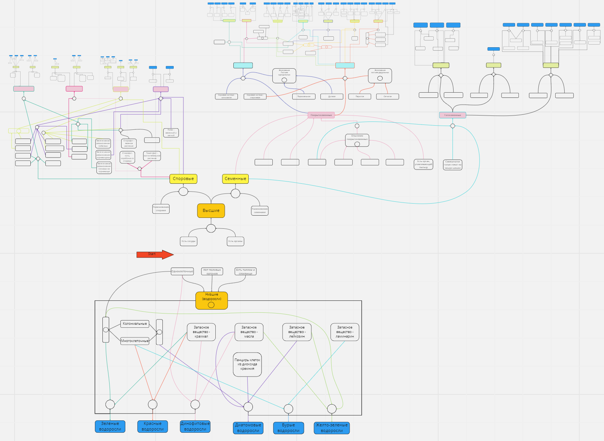

# Отчет по лабораторной работе
## по курсу "Искусственый интеллект"

### Студенты: 

| ФИО       | Роль в проекте                     | Оценка       |
|-----------|------------------------------------|--------------|
| Вврламова А.Б |Инженер по знаниям: описание и реализация базы знаний предметной области "Растения"|          |
| Михеева К.О |Разработчик: реализовала оболочку ЭС на python: Высшие(Споровые и Семенные(Голосеменные)) и Низшие(Водоросли), исправление ошибок|       |
| Пономарев Н.В|Разработчик: реализовал оболочку ЭС на python: Высшие(Семенные(Покрытосеменные)) и Низшие(Водоросли), тестирование |      |


> *Комментарии проверяющих (обратите внимание, что более подробные комментарии возможны непосредственно в репозитории по тексту программы)*

## Тема работы

Создание экспертной системы классификации растений для выявления вида растения путём определения его принадлежности к различным группам. Предметная область представляет собой царство "Растения", научная систематика которого позволяет легко выявить объединения растений на основе общих признаков и отличительные признаки одной единицы от другой. 

## Концептуализация предметной области

  В результате концептуализации предметной области были выделены следующие понятия: подцарства Высшие и Низшие растения, Высшие делятся на Семенные и Споровые. 
 Семенные в свою очередь делятся на отделы Покрытосеменные и Голосеменные, а Споровые на отделы Хвощеобразные, Папоротникообразные, Плаунообразные, Мохообразные.
 Невооруженным глазом видна строгая иерархия, идущая вплоть до видов.
  
 Ввиду того, что среди растений можно выделить разнобразные отделы, классы, семейства, любой участник может обособленно заниматься своим участком, единственной проблемой может стать пересечение отличительных признаков в комбинациях, но это можно исправить на общей схеме.

В общем виде графическое представление выглядит:

Из-за того, что дерево сильно ветвится, пришлось уменьшать размер следующих уровней, чтобы видеть целиком более ранние. Можно перейти по <code>[ссылке](https://miro.com/app/board/uXjVMfUKkUc=/)</code> и взглянуть на доску, а можно посмотреть в приближении на некоторые блоки.


## Принцип реализации системы

В данной работе мы использовали механизм прямого вывода. Наиболее удобным преимуществом использования механизма прямого вывода является возможность систематически и эффективно генерировать новые факты и выводить из них новые решения. Преимущества использования механизма прямого вывода в экспертной системе включают:

 Быстродействие. Механизм прямого вывода позволяет быстро принимать решения на основе доступной информации и правил вывода.

 Простота. Механизм прямого вывода легок в понимании и реализации, и не требует сложной математики или алгоритмов.

 Гибкость. Механизм прямого вывода позволяет легко изменять правила вывода и добавлять новые правила, что обеспечивает гибкость системы.

Для реализации механизма прямого вывода мы использовали язык Python и его библиотеку Pyknow. Она представляет набор инструментов для определения правил вывода и фактов, а также механизм для автоматического вывода заключений на основе этих правил и фактов. Также PyKnow предоставляет простой и интуитивно понятный интерфейс для определения правил вывода и фактов, что делает его доступным для широкого круга пользователей. В PyKnow позволяет легко изменять правила вывода и факты, что делает его гибким и адаптивным к изменяющимся условиям. 

## Механизм вывода

Механизм прямого вывода является одним из основных механизмов работы экспертных систем. Он представляет собой процесс логического вывода, при котором известные факты (знания) используются для вывода новых фактов и принятия решений.
Процесс работы механизма прямого вывода включает следующие шаги:

Инициализация фактов (знаний). На этом этапе происходит инициализация базы фактов, которая содержит начальные факты или знания.

Проверка правил. Этот шаг включает проверку всех правил базы знаний на соответствие истинности известных фактов. Если какое-то правило соответствует известным фактам, то оно становится активным.

Активация правил. После того, как правило становится активным, оно выполняется и выводится новый факт (знание).

Обновление базы фактов. Новый факт добавляется в базу фактов, и процесс проверки и активации правил повторяется для новых фактов.

Завершение процесса. Процесс логического вывода продолжается до тех пор, пока не будут выведены все необходимые факты или не будет достигнуто заданное условие остановки.

## Кусок кода:

```
    
    @Rule(AND(Fact('Есть сосуды'), Fact('Есть органы')))
    def Higher(self):
        self.declare(Fact('Высшие'))

    @Rule(OR(Fact('Одноклеточные'), Fact('Нет половых органов'), 
             Fact('Есть таллом и слоевище')))
    def Lower(self):
        self.declare(Fact('Низшие'))

    @Rule(AND(Fact('Высшие'), Fact('Размножение спорами')))
    def Spore(self):
        self.declare(Fact('Споровые'))

    @Rule(AND(Fact('Высшие'), Fact('Размножение семенами')))
    def Seeds(self):
        self.declare(Fact('Семенные'))

    @Rule(AND(Fact('Споровые'), Fact('Побег: весенний и летний'),
              Fact('Зеленое растение'), Fact('Заросток'),
              Fact('Размножение корневищами'),Fact('Корневище'),
              Fact('Мелкие'), Fact('Чешуевидные'),
              Fact('Прямостоящий'), Fact('Жесткий')))
    def Horsetails(self):
        self.declare(Fact('Хвощеобразные'))
```

Таким образом, механизм прямого вывода использует базу фактов и правил, чтобы генерировать новые факты и принимать решения. Он позволяет экспертной системе использовать имеющиеся знания для вывода новых знаний и решения задач в автоматическом режиме.

## Извлечение знаний и база знаний

Растения все проходили в школе на биологии, так что самые общие представления остались у всех. Эта тема неспроста была выбрана, так как классификацией растений давно занимаются учёные, и есть много материала на эту тему. Например, сначала можно было найти таблицы с отличительными признаками, чтобы не выделять самим их из текста.


Далее уже информации в таком виде было не найти, так как отличия семейств уже не проходят в школе, материал нужно было извлекать из текста. Конечно, в полученной базе знаний не представлены все существующие порядки, семейства, роды, виды, так как их нельзя даже сосчитать. Также данные в разных источниках разнятся, отличаясь уровнем иерархии и названием. Много времени заняло составление дерева И-ИЛИ, было бы здорово, если бы искусственный интеллект сам мог преобразовать текст в нечто подобное.

Дерево И-ИЛИ уже демонстрировалось ранее в отчёте, но <code>[ссылка](https://miro.com/app/board/uXjVMfUKkUc=/)</code> на него для удобства тут ещё раз.

## Протокол работы системы

### Вывод программы

Пример 1.

```
   planet = Planets()
   planet.reset()
   planet.declare(Fact('Есть сосуды'), Fact('Есть органы'),
               Fact('Размножение семенами'), Fact('Опыление - ветром'), 
               Fact('Семязачатки голые лежат на чешуе шишке'), Fact('Растут в тайге'), 
               Fact('Есть шишки'),Fact('Хвоя однолетняя'))
               
         
   planet.run()
   
   Это растение -  Лиственница
```
  


Пример 2.

```
    planet = Planets()
    planet.reset()
    planet.declare(Fact('Мохообразные'),Fact('Листья на главном стебле'),
              Fact('Рассеивание спор при раскрытии зубчиков коробочки'), 
              Fact('Листья собраны в розетку'))
    planet.run()
    
    Это растение -  Бриум
```


Пример 3.
```
   planet = Planets()
   planet.reset()
   planet.declare(Fact('Низшие'),Fact('Многоклеточные'),
           Fact('Запасное вещество - масла'), Fact('Запасное вещество - лейкозин'))
   planet.run()
   
   Это растение -  Желто-зеленые водоросли
```


## Выводы

В ходе создания экспертной системы у нас составилось мнение об этой работе и об экспертных системах в целом. Такое занятие достаточно долгое и монотонное, по части программиста нет работы в составлении базы знаний, максимум записать всё в дерево, а так этим занимается эксперт по отрасли. По поводу работы получившейся ЭС можно сказать, что она работает правильно благодаря PyKnow, но это правила И-ИЛИ, где нет отрицания, а оно пригодилось бы для сокращения перечисляемых условий. К примеру, для деления на подцарства Высшие и Низшие достаточно было бы указать, есть ли деление на органы, есть ли сосуды, есть ли настоящие ткани. Если есть, это Высшие, если нет - Низшие. Но пришлось писать условия, что нет половых органов, есть деление на таллом и слоевище, чтобы был записан факт "Низшие". Также очень неудобно, что нужны точные формулировки и отсутствуют вопросы. Не видя базы знаний, самому никогда не перечислить эти признаки. Ещё одно неудобство - переписывание схемы в код, в дальнейшем можно парсить графическое представление в правила.

В целом, экспертные системы нужны для решения уравнений, проводя попутные вычисления. Для определения же вида растения гораздно проще пользоваться внешним видом, чем информацией, какие запасные вещества использует. А ведь дифференцирование растений происходит зачастую именно по таким невидимым параметрам. Поэтому с данной задачей лучше бы справилась нейросеть, но экспертные системы имеют место быть.

Командная работа получилась эффективной за счёт мотивации участников и слаженности коллектива.
